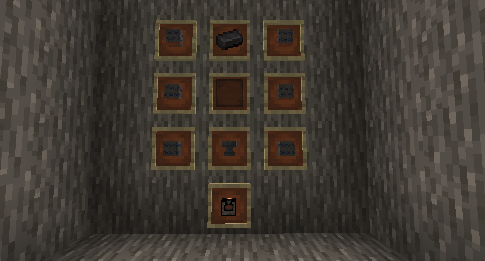

# **AcaciAddon**
This mod is a part of the ModulProject

The objective : Create a new difficulty with the Acacia Tree, with the AcaciAxe you can cut so much tree.
The AcaciAxe can be upgrade with simple compressed Acacia and more, when the AcaciAxe obtain the level 10 it becomes unbreakable

___
Content :
- Compressed Acacia : Simple to Octuple
- Acacia Stick
- AcaciAxe
- Acacia Enricher
- New Creative Tab
___
Craft :

Simple Compressed Acacia (9xAcacia Log) :

Double Compressed Acacia (9xSimple Compressed Acacia) :

Acacia Stick (2xDouble Compressed Acacia) :

AcaciAxe (2xAcacia Stick + 3xDouble Compressed Acacia) :

Acacia Enricher (6xQuadruple Compressed Acacia + Netherite ingot + Anvil + Black Stained Glass Pane) :

___
Gamaaaa and MrEliott35
___
 